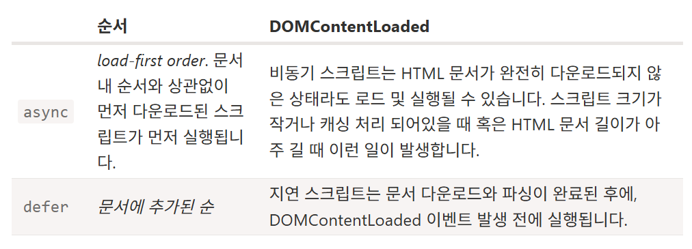
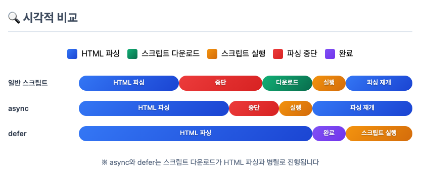

# 브라우저 렌더링 과정을 설명하시오.

서버에서 html, css, 자바스크립트 파일을 다운받고 렌더링 엔진이 html을
파싱해서 DOM 트리로 만든다. css를 파싱해서 cssom(CSS Object Model) 트리로 만들고 두 트리를 결합해 렌더링 트리를 만든다. 렌더 트리를 사용해서 각 요소의 위치와 크기를 계산한다. 이를 바탕으로 각 요소를 실제로 화면에 그린다.
자바스크립트 파일은 자바스크립트 엔진에서 실행되고 사용자와의 상호작용을 시작할 수 있다.
(이 페인트 단계에서 브라우저가 효율적인 작업을 위해 구성 요소를 여러개의 레이어로 나눠서 작업할 수도 있기 때문에 이 레이어를 합성하는 컴포지트 단계가 발생할 수도 있다.)

계산된 레이아웃을 기반으로 각 요소를 화면에 렌더링합니다.

 

주요 렌더링 경로

  
  1. DOM + CSSOM
      1. 초기 HTML, CSS 등 화면을 그릴 때 필요한 리소스를 다운로드함,
      2. HTML은 브라우저가 이해할 수 있는 파싱 과정을 거쳐 DOM을 만듦,
      3. CSS도 비슷하게 브라우저가 이해할 수 있는 CSSOM 트리 구조 형성(어떤 스타일 포함하는 지 정보)  
  2. 렌더 트리
      1. DOM + CSSOM 결합으로 생성된 트리
      2. 화면에 표시되는 각 요소 레이아웃 계산할 때 사용. 그러므로 display: none은 미포함
          - opacity:0 visibility: hidden은 포함. 사용자 눈에는 보이지 않지만 요소 자체는 있음
  3. 레이아웃
      1. 화면 구성 요소의 위치나 크기 계산하고 해당 위치에 요소를 배치하는 작업,
  4. 페인트
      1. 배치된 요소에 색을 채워 넣는 작업.,
      2. 브라우저는 효율적인 작업을 위해 구성 요소를 여러개의 레이어로 나눠 작업하기도 함
  5. 컴포지트
      1. 각 레이어 합성 단계. 페인트 단계에서 나눠진 레이어를 합성

## HTML 중간에 자바스크립트 파일이 있다면 HTML 파싱이 중단 되는 이유?

자바스크립트 코드를 파싱하고 실행하기 위해 HTML 파싱이 일시 중단됩니다.
자바스크립트가 DOM을 조작할 수 있기 때문에, 스크립트 실행이 끝난 뒤에 다시 HTML 파싱을 재개하여 DOM 트리를 계속 생성합니다.

 

브라우저 엔진 설명

<pre>
┌────────────────────┐
│ 브라우저 엔진 (Chromium) 
│                    │
│ ┌──────────────┐   │
│ │ 렌더링 엔진 (Blink) │ ← HTML, CSS 렌더링
│ └──────────────┘   │
│                    │
│ + 네트워크 스택        │ ← HTTP 요청
│ + 자바스크립트 엔진 (V8)
│ + 스토리지, 쿠키 관리 등
└────────────────────┘
</pre>

오픈 소스 웹 브라우저 종류

  
  1. Chromium
      - Google의 Chrome, Microsoft의 Microsoft Edge, Opera의 Opera Web Browser, 네이버 웨일
  2. Gecko
      - Mozilla Firefox

### Async vs defer의 차이점?

둘 다 스크립트를 비동기로 로드하는 script 태그 속성입니다. 둘 다 스크립트 파일 다운로드는 백그라운드에서 진행되나 async는 자바스크립트 파일이 실행될 때 html 파싱이 중단됩니다. defer는 html 파싱이 완료된 뒤에 자바스크립트 파일이 실행됩니다.

## Reflow와 Repaint의 차이점? 언제 발생하는지?

reflow는 레이아웃의 크기나 위치 변화가 있을 때, 변화된 레이아웃을 다시 계산하는 과정이고 repaint는 요소의 시각적인 표현의 변화가 있을 때, 화면에 다시 그리는 과정

웹 페이지 내에서 요소의 레이아웃(위치나 크기) 변화가 있을 때, 변화된 레이아웃을 다시 계산하는 과정

참조

    
  - 리플로우, 리페인트가 뭔데?  
      자바스크립트로 인해 요소의 width와 height가 변경되었을 때 브라우저는 해당 요소를 다시 계산해 화면을 새로 그려야 함, 그 말은 즉, CSSOM 새로 만들기 → 렌더 트리 → 레이아웃 → 페인트 → 컴포지트 과정을 다시 해야 하는 것..!
      - 리플로우: 레이아웃 -> 페인트 -> 컴포지트
      - 리페인트: 페인트 -> 컴포지트 
  - 그럼 리플로우, 리페인트 피하는 방법은 뭔데?  
    - transform, opacity 같은 속성 사용하기!  
    - 해당 속성 사용 시 요소를 별도의 레이어로 분리해 작업을 GPU에 위임하여 처리함으로써 레이아웃, 페인트 단계를 건너뛸 수 있음!
      → 이것을 하드웨어 가속이라고 함
    - 하드웨어 가속?
      CPU에서 처리해야 하는 작업을 GPU에 위임해 효율적으로 처리하는 방법
      GPU는 그래픽 작업 처리 위해 만들어진 것으로 화면 그릴 때 활용하면 굉장히 빠름,
      transform, opacity 사용 시 요소를 별도의 레이어로 분리해 GPU로 보냄.
      → 분리된 레이어는 GPU에 의해 처리로 레이아웃, 페인트 단계 없이 스타일 변경 가능
    - 애니메이션 transform과 opacity 속성 사용하여 GPU 활용, will-change 속성으로 자주 변경될 요소 힌트 주기(GPU에서 요소 미리 준비하게)
  - 인라인 스타일을 사용하면 브라우저가 캐시를 /// 구라일 수도

### Reflow와 Repaint 최적화 방법?

transform이나 opacity 같은 속성을 사용하면 됩니다. 해당 속성을 사용하면 요소를 별도의 레이어로 분리해서 변경 작업을 GPU에 위임해서 처리하기 때문에 레이아웃, 페인트 단계를 건너뛸 수 있습니다. 그리고 will-change 속성을 사용해 GPU에게 자주 변경될 요소라고 미리 알려줄 수도 있습니다.
